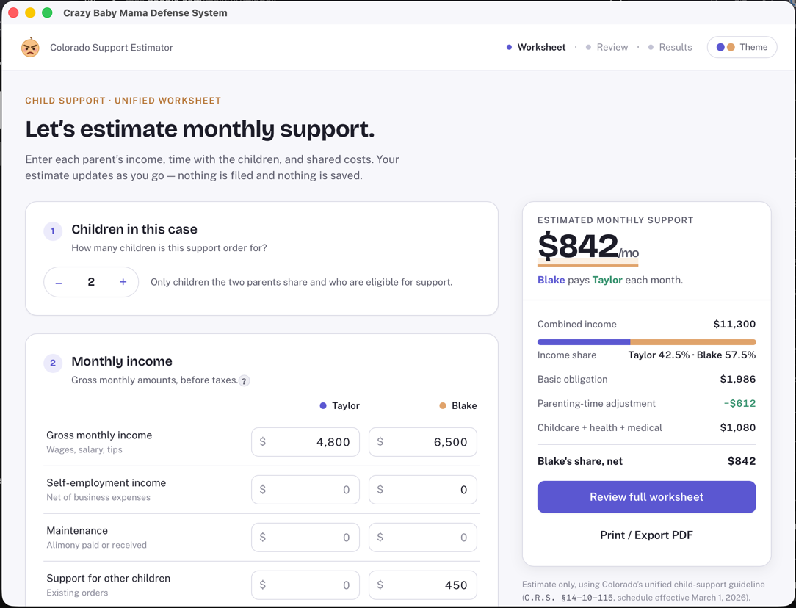

<p style="text-align: center">
  
</p>

# Crazy Baby Mama Defense System

A web app for estimating **family support in the State of Colorado** — child support
and spousal maintenance (alimony) — for "both" self-represented (pro se) parties and
family-law practitioners.

The goal is a modern, guided, "TaxCaster-like" experience: one thing at a time, generous
whitespace, and inline contextual help, while staying precise enough for professionals to
trust the math.

> ⚠️ **Estimates only.** This tool implements Colorado's statutory guidelines but is not
> legal advice, does not file anything, and does not save your data. Courts may deviate
> from the guideline. See [Legal basis](#legal-basis).

## Status

Early development. The **design system** and the **child-support worksheet**
exist as a pixel-faithful, static UI (presentational components with hardcoded example
values). No calculation logic or state wiring is implemented yet — see the
[Roadmap](#roadmap).

## Tech stack

- **React 19.2** + **TypeScript ~6** (strict, project references)
- **Vite 8** (Rolldown) with `@vitejs/plugin-react`
- **Tailwind CSS v4** (CSS-configured via `@tailwindcss/vite`; tokens mapped with
  `@theme inline`)
- **ESLint 10** (flat config)
- **Playwright** for e2e smoke tests
- Self-hosted variable fonts via `@fontsource-variable` (Bricolage Grotesque + Public Sans)
- **npm workspaces** monorepo — `apps/web` (this React app) + `apps/desktop`
- **Tauri v2** — packages the web app as a native desktop app (see
  [Run as a desktop app](#run-as-a-desktop-app))

## Getting started

This is an **npm-workspaces monorepo** — run every command **from the repo root**; the root
`package.json` delegates to the `apps/web` workspace.

```bash
npm install        # installs all workspaces into one root node_modules
npm run dev        # start the Vite dev server with HMR
```

Other scripts:

| Command | Description |
| --- | --- |
| `npm run dev` | Start the dev server with HMR |
| `npm run build` | Type-check and build (`tsc -b && vite build`) |
| `npm run preview` | Preview the production build locally |
| `npm run lint` | Run ESLint over the project |
| `npm run test` | Run the Vitest unit suite (`test:watch` for watch mode) |
| `npm run test:e2e` | Run the Playwright e2e smoke suite (auto-starts the dev server) |
| `npm run desktop:dev` | Launch the app in a native desktop window (Tauri) |
| `npm run desktop:build` | Build + bundle the macOS desktop app (`.app` / `.dmg`) |
| `npm run ios:dev` | Build + launch the app in the iOS Simulator (Tauri) |
| `npm run ios:build` | Build a signed App Store IPA (requires an Apple Developer account) |

### Run as a desktop app

The app can run as a native desktop app via **Tauri** (`apps/desktop/`), which wraps the
built web app in the OS-native webview — small installers, no bundled browser.

**Prerequisite:** the [Rust toolchain](https://rustup.rs) (`rustc`/`cargo`); on macOS also the
Xcode Command Line Tools. The web app itself needs neither.

```bash
npm run desktop:dev     # opens a native window; the web dev server + HMR run inside it
npm run desktop:build   # bundles apps/desktop/src-tauri/target/release/bundle/*.{app,dmg}
```

> The `desktop` scripts source `~/.cargo/env` first, so `cargo` is found even if the terminal
> was opened before Rust was installed (otherwise Tauri reports `failed to run 'cargo
> metadata' … No such file or directory`). `desktop:build` also sets `CI=true` so the DMG step
> skips Finder/AppleScript window styling — that step otherwise fails in non-GUI shells
> (background/SSH/CI); the `.dmg` is produced without a custom window layout.
>
> Only local **macOS** builds are set up today; Windows/CI packaging and code signing /
> notarization are deferred (unsigned local builds show a Gatekeeper warning off-machine).

#### Distributing the macOS build

`npm run desktop:build` produces a shareable `.dmg` (and the `.app`) under
`apps/desktop/src-tauri/target/release/bundle/`:

- `macos/Crazy Baby Mama Defense System.app`
- `dmg/Crazy Baby Mama Defense System_0.1.0_<arch>.dmg` — named from `productName`, `version`,
  and the **host CPU arch** (e.g. `aarch64` on Apple Silicon). The build targets the host arch
  only — a universal (Intel + Apple Silicon) binary is out of scope.

Hand someone the `.dmg` to install (mount → drag the app to Applications). Because the build
is **unsigned and un-notarized** (no Apple Developer ID yet), macOS Gatekeeper blocks the
first launch on another Mac. The recipient clears it once, either way:

- **Right-click** the app in Applications → **Open** → **Open** in the dialog, or
- from Terminal: `xattr -dr com.apple.quarantine "/Applications/Crazy Baby Mama Defense System.app"`

A warning-free open requires Developer ID **signing + notarization**, which is deferred.

### Run on iOS

The same Tauri harness targets iOS — the built web app runs in a native `WKWebView`.

**Prerequisites (macOS only):**

- **Xcode** (the full app, not just Command Line Tools)
- **CocoaPods** — `brew install cocoapods`
- iOS Rust targets — `rustup target add aarch64-apple-ios aarch64-apple-ios-sim x86_64-apple-ios`

```bash
npm run ios:dev     # compiles the Rust lib, boots the iOS Simulator, launches the app (HMR)
```

The Xcode project is generated (once) by `npx tauri ios init` and lives, tracked in git, at
`apps/desktop/src-tauri/gen/apple/` — it must sit inside the Tauri project because it links by
relative path to the Rust lib and the web `dist/`. Its own `.gitignore` excludes build output.
To run on a **physical device** later, the dev server must bind to `TAURI_DEV_HOST` — already
wired in `apps/web/vite.config.ts`, so `tauri ios dev` on a networked device works with no
further change (device dev also needs an Apple signing team; see below).

#### Distributing to the App Store (deferred — scaffolded, not yet active)

Everything for an App Store build is in place but **dormant** until there's a **paid Apple
Developer Program** membership and credentials. No secrets are committed — all are read from
the environment.

1. Set your **Team ID**: `export APPLE_DEVELOPMENT_TEAM=XXXXXXXXXX` (overrides
   `tauri.conf.json > bundle > iOS > developmentTeam`, keeping it out of git).
2. Build the IPA: `npm run ios:build` → `tauri ios build --export-method app-store-connect`,
   which emits `apps/desktop/src-tauri/gen/apple/build/arm64/<AppName>.ipa`.
3. Upload via **fastlane** (`apps/desktop/src-tauri/gen/apple/fastlane/`): `fastlane beta`
   (TestFlight) or `fastlane release` (App Store). Both build then upload using an **App Store
   Connect API key** supplied through env vars: `APP_STORE_CONNECT_API_KEY_ID`,
   `APP_STORE_CONNECT_ISSUER_ID`, `APP_STORE_CONNECT_API_KEY` (path to `AuthKey_*.p8`), plus
   `FASTLANE_APPLE_ID`. Without those set, the lanes are inert.

## Project structure

```
package.json     Workspace root (private; workspaces: ["apps/*"]) — root scripts delegate
apps/
  web/           @support-calculator/web — the React app
    src/
      components/
        ui/      Reusable design-system primitives (Card, Button, inputs, field rows…)
      features/
        worksheet/   Worksheet feature — components/ (AppHeader, WorksheetPage, ReviewPage,
                     ResultsPage, ResultsRail, WorksheetRecap, ParentingTimeBar,
                     SupportCitation), sections.ts, and index.ts (public API)
        navigation/  Guided-flow state — reducer model (stepFlow.ts) + useStepFlow() hook /
                     StepFlowProvider driving Worksheet → Review → Results
      types/     Shared/domain types, split by domain (e.g. common.ts)
      mocks/     Mock-fixture repository (SAMPLE_WORKSHEET / SAMPLE_ESTIMATE) — the shared
                 static example data, and future unit-test fixtures
      lib/       Small helpers (e.g. cn classname joiner, format.ts currency helpers)
      index.css  Tailwind import + Columbine tokens (:root / [data-theme="dark"])
      main.tsx   Font imports + app bootstrap
    config/      Build/deploy config — appConfig.ts (AppConfig type + loadAppConfig)
    e2e/         Playwright smoke tests (flow.spec.ts)
    public/      Static assets (favicon)
    .env         Build config defaults (APP_PORT); .env.local overrides (gitignored)
  desktop/       @support-calculator/desktop — Tauri v2 desktop + iOS harness
    src-tauri/   Cargo project: tauri.conf.json, src/{main,lib}.rs, capabilities/, icons/
      gen/apple/ Generated iOS Xcode project (tauri ios init) + fastlane/ (App Store lanes)
mockups/         "Columbine" design system: theme.css (token source of truth),
                 STYLEGUIDE.md, and reference PNGs rendered from mockups/src/*.html
```

## Configuration

Build settings are env-driven (all under `apps/web/`). `.env` supplies defaults — currently
just `APP_PORT` (the dev/preview server port, default `3000`); copy `.env.template` and
override per-machine in `.env.local` (gitignored). Values are parsed and typed by
`apps/web/config/appConfig.ts` (`AppConfig` / `loadAppConfig`) and consumed in
`apps/web/vite.config.ts`. Tauri's `devUrl` is pinned to `3000`, so if you change `APP_PORT`,
update `apps/desktop/src-tauri/tauri.conf.json` to match.

## Testing

A small **Playwright** e2e suite (`apps/web/e2e/`) smoke-tests the guided flow — that it loads on the
Worksheet, navigates Worksheet → Review → Results, that Edit links jump back to their section,
and that the stepper chips switch views. Run it with `npm run test:e2e`; Playwright
starts the dev server itself and uses your installed Google Chrome (`channel: 'chrome'`).
Unit tests run on **Vitest** — `npm run test` (or `npm run test:watch`). They cover the
calculation engine (against the real shipped statute data), the rule-set validation and
repository, the worksheet store, and the navigation reducer.

## Design system — "Columbine"

The visual language is grounded in Colorado: columbine indigo/periwinkle primary,
sandstone/sunset accent, slate neutrals. Light and dark themes flip at runtime via
`data-theme` on `<html>`.

- **Token source of truth:** `mockups/theme.css`
- **Spec & component catalog:** `mockups/STYLEGUIDE.md`
- **Reference mockups:** `mockups/worksheet-{light,dark}.png`, `mockups/styleguide.png`

A **semantic party-color rule** runs through the whole UI: **Parent A is always primary
(indigo)** and **Parent B is always accent (sandstone)** — in income columns, the
parenting-time bar, and the income-share split.

## Roadmap

Feature status is tracked in **[CLAUDE.md](./CLAUDE.md#feature-roadmap--status)** and
updated as work lands. Snapshot:

| Feature | Mockup | Static UI | Logic |
| --- | :---: | :---: | :---: |
| Columbine design system & theme | ✅ | ✅ | — |
| Reusable UI component library | ✅ | ✅ | — |
| Child-support worksheet (income, parenting time, shared costs) | ✅ | ✅ | ✅ |
| Results rail (estimate breakdown) | ✅ | ✅ | ✅ |
| Review step (grouped recap, Edit links) | ⬜ | ✅ | ✅ |
| Guided-flow navigation (Worksheet → Review → Results, `useStepFlow`) | — | ✅ | ✅ |
| Detailed results / printable summary (Results step) | ⬜ | ✅ | ✅ |
| Spousal maintenance (alimony) flow | ⬜ | ⬜ | ⬜ |
| Support-calculation engine (C.R.S. §14-10-115, HB 25-1159) | ⬜ | — | ✅ |
| Statute data layer (rule sets, validation, MCP-ready port) | — | — | ✅ |
| State wiring / live-updating estimate | ⬜ | ✅ | ✅ |
| Worksheet input validation (field errors, frozen estimate) | ✅ | ✅ | ✅ |
| Persisted user preferences (storage port, Zod boundary) | — | — | ✅ |
| Theme preference — three-state Light/Dark/System, no flash | ✅ | ✅ | ✅ |
| Print / Export PDF | ⬜ | ✅ | ⬜ |
| Multi-state support (additional jurisdictions) | — | — | ⬜ |
| Desktop app (Tauri, `apps/desktop`) — macOS local build | — | — | ✅ |
| Mobile app (Tauri iOS, `apps/desktop`) — simulator build | — | — | ✅ |
| iOS App Store distribution (fastlane, signing) | — | — | ⬜ |

✅ done · 🎨 mockup only · ⬜ not started · — n/a

## Legal basis

Calculation logic follows Colorado family-support law (**C.R.S. §14-10-115**), as amended by
**HB 25-1159, effective 1 March 2026**. That act eliminated the former 93-overnight "cliff"
and the 1.50 shared-care multiplier — every overnight now earns a parenting-time credit from
a continuous table — raised the schedule ceiling to $40,000 combined monthly income, and made
the self-support reserve a function of the state minimum wage.

Statutory values are **data, not code**: the schedule, credit table, low-income bands and
reserve formula live in `apps/web/src/services/rules/data/co/2026.json`, each carrying the
subsection it comes from, and are validated on load. Updating for an amendment — or adding
another state — means adding a rule set, not editing the engine.

- **HB 25-1159 Final Act** — https://leg.colorado.gov/bill_files/85404/download
  (the machine-readable source the tables were transcribed from; the *Signed Act* PDF is a
  scan with no extractable text)
- C.R.S. Title 14 (2024) —
  https://content.leg.colorado.gov/sites/default/files/images/olls/crs2024-title-14.pdf
  (useful for surrounding statutory text, but note it **omits** the schedule table itself)
- Colorado child support guide — https://divorce.law/guides/child-support-calculator/colorado/

> **This is an estimate, not legal advice.** Courts may deviate from the guidelines, and the
> figures here are not a substitute for advice from a Colorado family-law attorney.

## Contributing

See [CLAUDE.md](./CLAUDE.md) for conventions (functional components, Tailwind utilities,
`type` over `interface`, type organization) and the git/safety workflow (branch per task;
never commit or push without explicit permission).
